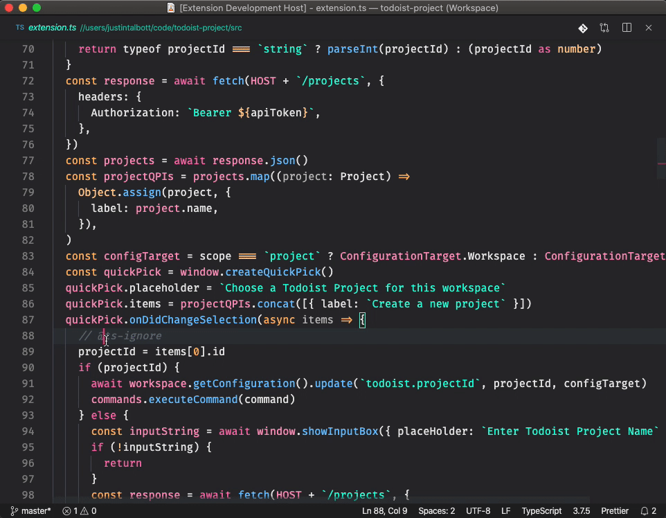

# VSCode Todoist

Track and sync your development todos with [Todoist](https://todoist.com), right in VSCode!



## Features & Usage

Each command has a global user, workspace, and parameterized version. Both the global user and workspace commands will use the Todoist project set in your `todoist.projectId` setting; if this is not set, then you will be prompted to choose or create a Todoist project. Parameterized commands, on the other hand, take the Todoist project as a parameter. Note that parameterized commands do not have a default keybinding, and instead require you to configure your own keybindings for them.

This VSCode extension adds several commands to the command palette:

### Todoist Capture [Workspace]

Default Keybinding <kbd>alt+t c</kbd>.

Pop open an input box to capture a todo for your current project. If you have a text selection made when this is invoked, it will pre-populate the input field with a link to your current file and line number, for easy deep linking from the Todoist desktop app.

### Todoist Todos [Workspace]

Default Keybinding <kbd>alt+t t</kbd>.

Shows all the incomplete todos in your current Todoist project. Selecting an item will toggle its completeness. Press <kbd>Esc</kbd> to dismiss the list.

### Todoist Open [Workspace]

Default Keybinding <kbd>alt+t o</kbd>.

If you have the Todoist desktop app installed, this will open or switch to the Todoist app and select your current project.

### Todoist Capture [Global]

Default Keybinding <kbd>alt+t C</kbd>.

Pop open an input box to capture a todo for your global user project. If you have a text selection made when this is invoked, it will pre-populate the input field with a link to your current file and line number, for easy deep linking from the Todoist desktop app.

### Todoist Todos [Global]

Default Keybinding <kbd>alt+t T</kbd>.

Shows all the incomplete todos in for your global user project. Selecting an item will toggle its completeness. Press <kbd>Esc</kbd> to dismiss the list.

### Todoist Open [Global]

Default Keybinding <kbd>alt+t O</kbd>.

If you have the Todoist desktop app installed, this will open or switch to the Todoist app and select your global user project.

### Todoist Capture [Id]

No default keybinding.

Pop open an input box to capture a todo for the chosen Todoist project. If you have a text selection made when this is invoked, it will pre-populate the input field with a link to your current file and line number, for easy deep linking from the Todoist desktop app.

### Todoist Todos [Id]

No default keybinding.

Shows all the incomplete todos in the chosen Todoist project. Selecting an item will toggle its completeness. Press <kbd>Esc</kbd> to dismiss the list.

### Todoist Open [Id]

No default keybinding.

If you have the Todoist desktop app installed, this will open or switch to the Todoist app and select your chosen project.

## Configuring Custom Project Shortcuts

You can configure multiple shortcuts to help you open, list, and capture todos for your Todoist projects. To do this, you will need to add a keybinding for each shortcut you want to use. For example, to add a shortcut for a project with the id `123456789`, you would add the following to your `keybindings.json` file:

```json
{
  "key": "ctrl+c+1",
  "command": "extension.todoistCaptureId",
  "args": "123456789" // here goes the project id
}
```

The commands you can use are:

* `extension.todoistCaptureId`
* `extension.todoistTodosId`
* `extension.todoistOpenId`

For more information on how to configure keybindings, see the [VSCode documentation](https://code.visualstudio.com/docs/getstarted/keybindings).

## Requirements & Installation

Obviously this requires a [Todoist](https://todoist.com) account. To use "Todoist Open" and take advantage of the deep linking feature, you will also need the Todoist desktop app.

To install this extension, you can get it from VSCode store or open the command palette and enter:

```sh
ext install waymondo.todoist
```

Finally, run any extension command from the command palette and you will be prompted to enter your Todoist API token,
which can be found [here](https://todoist.com/prefs/integrations).

You may set `todoist.projectId` in your user and workspaces settings manually or with the commands above.

## Project Goals & Motivation

* Create a simple and lightweight method of capturing and organizing tasks on a per-project basis.

* Leverage a well-featured todo app service instead of re-invent the wheel.

* Todoist is a good candidate for such a service, since you can easily stay in touch with your todos on the go with their mobile apps.

* Implement a way where the basic features can be used strictly from within VSCode.

## Known Issues

I have not yet tested on any platforms other than macOS. Ideas for improvement and patches are welcome!
